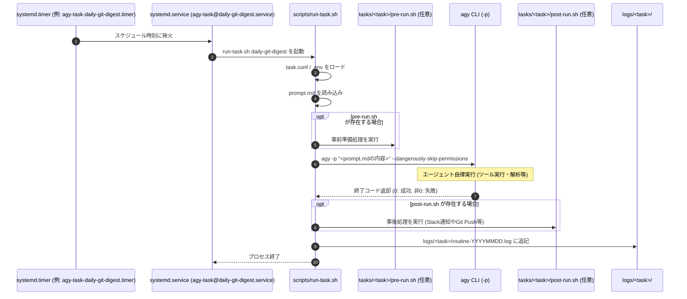

# アーキテクチャとマルチタスク設計詳細

本ドキュメントでは、複数の定期実行タスクを独立して管理・実行するためのアーキテクチャ設計および動作メカニズムについて解説します。

---

## 1. マルチタスク分離の設計思想

本基盤では、タスクごとに以下の要素を完全に分離・独立させています。

1. **指示書（Prompt）の独立**:
   - `tasks/<task-name>/prompt.md` に Markdown 形式で詳細な指示書を配置。
   - シェルコマンドの引数に長いプロンプトを直書きする必要がなく、複数行の複雑な指示、チェックリスト、制約条件をきれいにバージョン管理できます。
2. **スケジュールと設定の独立**:
   - `tasks/<task-name>/task.conf` で個別の実行スケジュール（`SCHEDULE`）、思考レベル（`EFFORT`）、タイムアウト（`TIMEOUT`）、有効無効（`ENABLED`）を設定。
3. **ログの独立**:
   - 各タスクの標準出力・エラー出力は `logs/<task-name>/routine-YYYYMMDD.log` にタスク別・日付別で記録。
4. **ライフサイクル管理の独立**:
   - 各タスクごとに独立した systemd タイマー（`agy-task-<task-name>.timer`）が割り当てられるため、あるタスクの一時停止や実行時刻変更が他のタスクに影響を与えません。

---

## 2. systemd テンプレートユニットによる洗練された管理

複数のタスクを効率よく管理するため、systemd の **テンプレートユニット（Template Unit）** 機能を活用しています。

```
systemd/agy-task@.service  ──>  共通テンプレート (%I にタスク名が入る)
                                  ├── agy-task@daily-git-digest.service
                                  └── agy-task@weekly-dependency-check.service
```

### なぜテンプレートサービスなのか？
- 新しいタスクを追加するたびに `.service` ファイルを増やす必要がありません。
- 実行処理はすべて `scripts/run-task.sh %I` を経由するため、PATH 解決や共通ロジックの修正が 1 箇所の変更で全タスクに適用されます。

### タイマーとのマッピング
タイマー側はタスクごとに発火スケジュールが異なるため、`install-tasks.sh` が `tasks/` をスキャンして各タスク専用のタイマーユニット（`agy-task-<task-name>.timer`）を自動生成します。
このタイマーは内部で `Unit=agy-task@<task-name>.service` を呼び出すため、名前が連携して正確に該当タスクを実行します。

---

## 3. 実行シーケンス (Multi-Task Sequence)



---

## 4. フック機能 (Hooks) による拡張性

タスクディレクトリ内に以下のスクリプトを置くことで、エージェント実行の前後に任意のカスタムロジックを挟むことができます。

- **`pre-run.sh`**:
  - 用途: `git fetch`、キャッシュのクリア、必要なテスト環境コンテナの立ち上げなど。
- **`post-run.sh`**:
  - 用途: エージェントの実行成否（`TASK_EXIT_CODE`）に応じた Slack / Discord / LINE 通知、自動コミット・プッシュなど。
