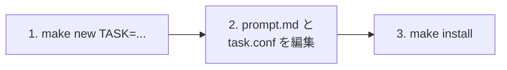

# 新規タスク作成・追加ガイド (Makefile 対応版)

本リポジトリでは、`Makefile` コマンドを使用して、**新しい定期実行タスクの作成・設定・テスト・タイマー登録** を手軽に行うことができます。

---

## 1. タスク追加の流れ (3ステップ)



### ステップ 1: 新規タスクを作成
```bash
cd ~/workspace/agy-routine
make new TASK=my-new-task
```
※ `tasks/_template` のひな形が自動的に `tasks/my-new-task/` にコピーされ、必要なファイルが配置されます。

---

### ステップ 2: 設定ファイルと指示書を編集

#### (1) `tasks/my-new-task/task.conf` (スケジュール・設定)
実行スケジュールやモデルの思考レベルを設定します。

```bash
# 実行スケジュール (systemd OnCalendar 形式)
# 例: 毎日 深夜 02:00
SCHEDULE="*-*-* 02:00:00"

# エージェントの思考レベル (low | medium | high)
EFFORT="medium"

# タイムアウト秒数 (デフォルト: 600秒 = 10分)
TIMEOUT=600

# 有効/無効フラグ (true | false)
ENABLED="true"
```

> **スケジュール書式例 (systemd OnCalendar)**:
> - 毎朝 09:00 (平日のみ): `Mon..Fri *-*-* 09:00:00`
> - 毎日 深夜 03:00: `*-*-* 03:00:00`
> - 毎週月曜 10:00: `Mon *-*-* 10:00:00`
> - 毎時 0分: `*-*-* *:00:00`
> - 30分ごと: `*:0/30`

#### (2) `tasks/my-new-task/prompt.md` (エージェントへの指示書)
Antigravity CLI に実行させたいプロンプトを Markdown 形式で詳細に記述します。

```markdown
# タスク: コード品質と未解決 TODO の点検

リポジトリ内のコードを点検し、日次品質レポートを作成してください。

## 指示内容
1. `src/` 配下のソースコードで `TODO:` または `FIXME:` コメントを検索して一覧化してください。
2. `pnpm test` を実行し、全テストがパスすることを確認してください。
3. 問題や未解決事項があれば、推奨される修正案を Markdown で要約して出力してください。
```

---

### ステップ 3: タイマーの反映・インストール
```bash
make install
```
※ 自動的に `tasks/` をスキャンし、新しいタスクの systemd タイマー（`agy-task-my-new-task.timer`）を生成・登録・即時有効化します。

---

## 2. 動作確認・テスト実行

スケジュール時刻を待たずに、手動でテスト実行します。

```bash
# 手動テスト実行
make run TASK=my-new-task

# ログファイルの確認
make log TASK=my-new-task

# リアルタイムログ (journalctl) の追跡
make journal TASK=my-new-task
```

---

## 3. 高度なカスタマイズ: フックスクリプト (Hooks)

タスクディレクトリ内に以下のスクリプトを配置し、実行権限（`chmod +x`）を付与すると、エージェント実行の前後に自動実行されます。

### 事前処理 (`tasks/<タスク名>/pre-run.sh`)
エージェント起動前の事前準備を行いたい場合に配置します。
```bash
#!/usr/bin/env bash
echo "タスク実行前の事前準備を行っています..."
git fetch --all --prune
```

### 事後処理 (`tasks/<タスク名>/post-run.sh`)
エージェント完了後に通知を送ったり、Git プッシュを行いたい場合に配置します。環境変数 `TASK_EXIT_CODE` でエージェントの成否が渡されます。
```bash
#!/usr/bin/env bash
if [[ "${TASK_EXIT_CODE}" -eq 0 ]]; then
  echo "タスクが正常終了しました。Slack等に通知を送信します..."
  # curl -X POST -H 'Content-type: application/json' --data '{"text":"定期タスク成功"}' $SLACK_WEBHOOK_URL
else
  echo "タスクがエラー終了しました (Code: ${TASK_EXIT_CODE})。"
fi
```

---

## 4. タスクの一時停止・再開・削除

```bash
# 一時停止
make stop TASK=my-new-task

# 再開
make start TASK=my-new-task

# 削除
make stop TASK=my-new-task
rm -rf tasks/my-new-task
make install
```
